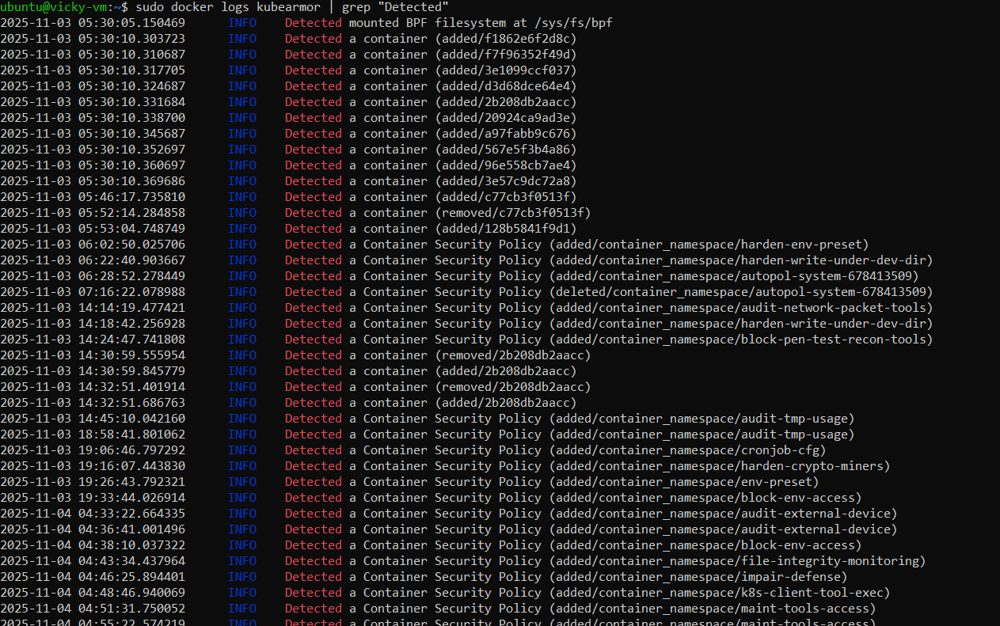
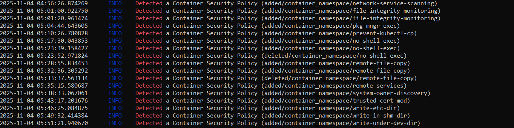

# 🔐 KubeArmor VM/Bare-metal Container Hardening Policies

This repository provides a curated collection of **container-scoped runtime security policies** for **VM or bare-metal environments** using **KubeArmor**.  
Each policy enhances **workload protection** by enforcing runtime restrictions at the **container or host level** — without requiring Kubernetes.

---

## ⚙️ Overview

These policies defend against:

- 🛡️ Defense Evasion  
- 🔑 Credential Exfiltration  
- 🔍 System Reconnaissance  
- 📦 Unauthorized Package Installation  
- 🔐 Certificate Tampering  
- 🎭 Masquerading & Persistence  
- 📝 Unauthorized File Writes  
- 🌐 Network & Remote Access Abuse  

All policies are written in **KubeArmorPolicy (container scope)** format, deployable via the `karmor` CLI on **Ubuntu-based VMs**.

---

## 🧰 Prerequisites

Ensure your system meets the following requirements:

| Component | Description |
|------------|--------------|
| **OS** | Ubuntu 22.04+ (VM or Bare-metal) |
| **Container Runtime** | Docker or containerd |
| **KubeArmor** | Installed and running |
| **LSM** | AppArmor / SELinux / BPF-LSM (enabled) |
| **CLI** | `karmor` installed |

Check your setup:

```bash
sudo karmor status
```

Expected output:  
✅ KubeArmor is active  
✅ LSM: AppArmor (or BPF-LSM) enabled  
✅ gRPC connected  

---

## 🧭 Environment Setup Summary

Below is the summarized workflow we followed during setup:

1. **Created Ubuntu VM in Oracle Cloud (OCI)**  
   → `Canonical Ubuntu 22.04` image, with public key authentication  
2. **Installed KubeArmor in VM mode**  
   ```bash
   curl -s -L https://raw.githubusercontent.com/kubearmor/KubeArmor/main/install.sh | sudo bash
   ```
3. **Verified service status**
   ```bash
   sudo systemctl status kubearmor
   sudo karmor status
   ```
4. **Deployed sample Docker container**
   ```bash
   docker run -dit --name test-container ubuntu:latest
   ```
5. **Applied and validated multiple KubeArmor container policies**

---

## 📋 Policy Categories

| Category | Description |
|-----------|--------------|
| 🛡️ **Defense Evasion** | Detect and block attempts to disable or bypass security controls |
| 🔑 **Credential Exfiltration** | Prevent data theft via `scp`, `ftp`, etc. |
| 🔍 **System Reconnaissance** | Detect enumeration via `whoami`, `id`, etc. |
| 📦 **Package Management** | Restrict `apt-get`, `yum`, or similar commands |
| 🔐 **Trusted Certificate Tampering** | Protect `/etc/ssl`, `/usr/local/share/ca-certificates/` |
| 🎭 **Masquerading & Persistence** | Block unauthorized file writes or privilege escalation |
| 📝 **File Integrity Monitoring** | Audit or block writes under `/etc`, `/dev`, `/dev/shm` |
| 🌐 **Remote Services** | Monitor SSH, Sudoers, or `/etc/hosts.allow` activity |

---

## 🚀 Applying Policies

### 1️⃣ Create a policy file
```bash
nano <policy-name>.yaml
```

### 2️⃣ Apply the policy
```bash
sudo karmor vm policy add <policy-file>.yaml
```


### 3️⃣ Optional: Apply via specific gRPC endpoint
```bash
sudo karmor vm policy add <policy-file>.yaml --gRPC 127.0.0.1:50051

```


---

## 🧪 Testing Policies

Example — testing a file write protection policy:

```bash
# Access the container
sudo docker exec -it test-container bash

# Attempt restricted operation
touch /dev/shm/testfile  # Should trigger Audit/Block

# Exit container
exit
```

Monitor logs:

```bash
sudo karmor logs
```

Expected message:
```
[Audit] Detected attempt to write to /dev/shm folder
```

---

## 🗑️ Removing Policies

```bash
sudo karmor vm policy delete <policy-file>.yaml
```

---

## 🧠 Example Workflow (End-to-End)

```bash
# 1. Create policy
vim write-under-dev-dir.yaml

# 2. Apply
sudo karmor vm policy add write-under-dev-dir.yaml

# 3. Verify in logs
sudo karmor logs

# 4. Test in container
docker exec -it test-container bash
touch /dev/testfile

# 5. Remove when done
sudo karmor vm policy delete write-under-dev-dir.yaml
```

---

## 🐞 Troubleshooting Guide

### Policy not taking effect
- Run `sudo karmor status`  
- Ensure container is **running** and **KubeArmor service** is active  
- Check syntax and indentation in YAML  

### Operations not blocked
- Ensure policy was applied successfully  
- Paths in rules must match container paths  
- Check logs: `sudo karmor logs`  

### gRPC errors
- Default address: `127.0.0.1:50051`  
- Verify service: `sudo systemctl status kubearmor`  
- View logs: `journalctl -u kubearmor -f`  

---

## 📚 References

- [KubeArmor Official Docs](https://docs.kubearmor.io/)
- [KubeArmor Policy Examples](https://github.com/kubearmor/KubeArmor/tree/main/examples)
- [AccuKnox Platform](https://app.demo.accuknox.com/)
- [VM/Bare-metal Deployment Guide](https://docs.kubearmor.io/kubearmor/quick-links/deployment_guide)

---

**⭐ Star this repo if you find it useful!**  
**🛠 Maintained by:** Vicky Dewangan ,Forward Deployed Engineer
