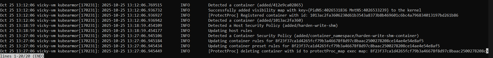

# 🔐 VM/Bare-metal Container Hardening Policies using KubeArmor

This repository contains a curated collection of **container-scoped security policies** built for **runtime workload protection** using **KubeArmor in VM/bare-metal mode**.

These policies help detect and prevent:

- Defense evasion
- Credential exfiltration
- System reconnaissance
- Package installation
- Certificate trust tampering
- Masquerading & persistence
- Unauthorized file writes
- Network-based attacks

All policies follow **least privilege** and are designed for **container-level enforcement on standalone hosts**.

---

## 🧰 Prerequisites

Ensure the following components are installed:

- Ubuntu/Linux VM or bare-metal server
- Docker or container runtime
- KubeArmor service running
- LSM Enabled:
  - AppArmor
  - SELinux
  - BPF-LSM (recommended)
- `karmor` CLI installed

Check status:

```bash
sudo karmor status
```

---

## 📋 Policy Categories

The policies in this repository cover various security domains:

### 🛡️ Defense Evasion
Prevent attackers from disabling security mechanisms or hiding their tracks.

### 🔑 Credential Exfiltration
Block unauthorized access to sensitive credentials and secrets.

### 🔍 System Reconnaissance
Detect and prevent information gathering activities.

### 📦 Package Installation
Control software installation to prevent malicious package deployment.

### 🔐 Certificate Trust Tampering
Protect certificate stores from unauthorized modifications.

### 🎭 Masquerading & Persistence
Prevent attackers from establishing persistent access or impersonating legitimate processes.

### 📝 Unauthorized File Writes
Block writes to critical system files and directories.

### 🌐 Network Security
Control network operations and prevent reconnaissance.

---

## 🚀 Usage

### Applying Policies

1. **Create or edit a policy file:**

```bash
nano <policy-name>.yaml
```

2. **Apply the policy:**

```bash
sudo karmor vm policy add <policy-file>.yaml
```



3. **Optional - Specify custom gRPC server:**

```bash
sudo karmor vm policy add <policy-file>.yaml --gRPC 127.0.0.1:50051
```

### Testing Policies

Test policies by accessing your container and attempting blocked operations:

```bash
# Access the container
docker exec -it <container-name> /bin/bash

# Try operations that should be blocked by the policy
touch /dev/shm/testfile  # Example for write protection policy

# Exit container
exit
```

### Removing Policies

Remove policies when they're no longer needed:

```bash
sudo karmor vm policy delete <policy-file>.yaml
```

### Monitoring Policy Violations

Monitor policy enforcement and violations in real-time:

```bash
sudo karmor logs
```

---

## 📝 Example Workflow

Here's a complete example of applying and testing the `/dev/shm` write protection policy:

```bash
# 1. Create the policy file
nano harden-write-shm-ubuntu.yaml

# 2. Apply the policy
sudo karmor vm policy add harden-write-shm-ubuntu.yaml
# Output: Policy Applied

# 3. Test in a container
docker exec -it ubuntu-VD /bin/bash
root@8f23f37ca1d4:/# touch /dev/shm/testfile
# Operation should be blocked by KubeArmor
root@8f23f37ca1d4:/# exit

# 4. Monitor the blocked attempt
sudo karmor logs

# 5. Remove policy if needed
sudo karmor vm policy delete harden-write-shm-ubuntu.yaml
```

---

## 🔍 Available Commands

### Policy Management

```bash
karmor vm policy add <file>       # Apply a new policy from YAML file
karmor vm policy delete <file>    # Remove an existing policy
```

### Global Flags

- `--gRPC <address>` - Specify KubeArmor gRPC server address (default: 127.0.0.1:50051)
- `-h, --help` - Display help information

### Examples

```bash
# Apply a file-access policy
sudo karmor vm policy add ./harden-file-integrity-ubuntu.yaml

# Apply with custom gRPC server
sudo karmor vm policy add ./harden-write-dev-ubuntu.yaml --gRPC 192.168.1.100:50051

# Remove a policy
sudo karmor vm policy delete ./harden-network-service-scanning-ubuntu.yaml

# Get help
karmor vm policy --help
karmor vm policy add --help
```
---

## 🐛 Troubleshooting

### Policy Not Applied

**Symptoms:** Policy add command succeeds but protection doesn't work

**Solutions:**
- Verify KubeArmor service is running: `sudo karmor status`
- Check policy syntax and YAML formatting
- Ensure gRPC server is accessible (default: `127.0.0.1:50051`)
- Verify LSM (AppArmor/BPF-LSM) is active on your system

### Container Operations Not Blocked

**Symptoms:** Blocked operations still succeed inside container

**Solutions:**
- Confirm policy was successfully applied: check for "Policy Applied" message
- Review policy rules and file paths - ensure they match your container paths
- Check if container name/ID matches policy selectors
- Verify LSM enforcement: `sudo aa-status` (for AppArmor)
- Review logs for policy violations: `sudo karmor logs`

### gRPC Connection Issues

**Symptoms:** Cannot connect to KubeArmor gRPC server

**Solutions:**
- Verify KubeArmor service is running: `systemctl status kubearmor`
- Check firewall rules if using remote gRPC server
- Explicitly specify gRPC address: `--gRPC 127.0.0.1:50051`
- Review KubeArmor service logs: `journalctl -u kubearmor -f`

### Policy Conflicts

**Symptoms:** Multiple policies causing unexpected behavior

**Solutions:**
- List all applied policies and review for conflicts
- Remove conflicting policies: `sudo karmor vm policy delete <file>`
- Apply policies incrementally and test each one
- Ensure policy rules don't overlap or contradict

---

## 📖 Additional Resources

- [KubeArmor Documentation](https://docs.kubearmor.io/)
- [KubeArmor VM/Bare-metal Deployment Guide](https://docs.kubearmor.io/kubearmor/quick-links/deployment_guide)
- [Policy Examples](https://github.com/kubearmor/KubeArmor/tree/main/examples)
- [AccuKnox Platform](https://www.accuknox.com/)

---


**⭐ If you find this repository helpful, please star it!**
